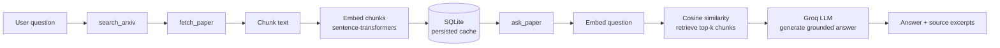

# 📄 Research Assistant — MCP Server + RAG Pipeline

An MCP (Model Context Protocol) server that lets an AI client search arXiv, fetch papers, and answer questions **grounded in the actual paper text** — a full retrieve-and-generate RAG pipeline exposed through all three MCP primitives (tools, resources, and prompts), plus a standalone demo UI.

[](https://github.com/ayushisingh51/PaperPilot-AI/actions/workflows/tests.yml)
[](https://www.python.org/)
[](LICENSE)

<!-- Replace with your actual demo GIF/screenshot once recorded -->
<!--  -->

## Why this exists

Most "I built an MCP server" projects stop at wrapping a single API call in a tool. This project instead demonstrates a complete, real pipeline:

**search → fetch → chunk → embed → retrieve → generate**

...exposed through MCP so it's usable directly from Claude Desktop or any other MCP client, with a companion Streamlit UI for visual demos.

## Architecture



## Features

| MCP Primitive | Name | What it does |
|---|---|---|
| Tool | `search_arxiv` | Search arXiv by keyword |
| Tool | `fetch_paper` | Download a paper's PDF, extract + chunk + embed its text |
| Tool | `ask_paper` | Answer a question grounded in a fetched paper's content (RAG) |
| Tool | `compare_fetched_papers` | Compare two fetched papers' methods and contributions |
| Resource | `papers://list` | Browse every paper fetched so far |
| Resource | `papers://{paper_id}` | View a specific paper's full extracted text |
| Prompt | `literature_review` | Scaffolds a multi-paper research workflow |
| Prompt | `compare_papers` | Scaffolds a structured two-paper comparison |

**Plus:**
- **Persistence** — fetched papers survive a server restart (SQLite), not just in-memory.
- **Error handling** — bad paper IDs, network failures, and LLM errors return clean messages instead of crashing.
- **20 automated tests** — all external calls (arXiv, PDF download, Groq) are mocked, so the suite runs in seconds with zero API cost. CI runs them on every push.
- **Demo UI** — a Streamlit app that reuses the exact same functions as the MCP server (no duplicated logic), with retrieved excerpts shown visually to make the RAG mechanism transparent.

## Tech stack

- **Protocol:** [MCP](https://modelcontextprotocol.io/) via [FastMCP](https://github.com/jlowin/fastmcp)
- **Embeddings:** `sentence-transformers` (`all-MiniLM-L6-v2`, runs locally, no API cost)
- **LLM:** [Groq](https://groq.com/) (`llama-3.3-70b-versatile`)
- **Data:** [arXiv API](https://arxiv.org/help/api), `pypdf` for text extraction
- **Storage:** SQLite
- **Testing:** `pytest` + `pytest-mock`
- **Demo UI:** Streamlit

## Setup

### 1. Clone and install
```bash
git clone https://github.com/ayushisingh51/PaperPilot-AI.git
cd PaperPilot-AI
python -m venv venv
source venv/bin/activate   # Windows: venv\Scripts\activate
pip install -r requirements.txt
```

### 2. Add your API key
```bash
cp .env.example .env
# then edit .env and add your free key from https://console.groq.com/keys
```

### 3. Run it

**As an MCP server** (test in the MCP Inspector):
```bash
fastmcp dev server.py
```

**Connected to Claude Desktop** — add to `claude_desktop_config.json`:
```json
{
  "mcpServers": {
    "research-assistant": {
      "command": "/absolute/path/to/venv/bin/python",
      "args": ["/absolute/path/to/research-mcp/server.py"]
    }
  }
}
```

**As a standalone demo UI:**
```bash
streamlit run demo_app.py
```

### 4. Run the tests
```bash
pytest tests/ -v
```

## Project structure
```
PaperPilot-AI/
├── server.py                # MCP server: tools, resources, prompts
├── demo_app.py               # Standalone Streamlit demo UI
├── tests/
│   ├── conftest.py           # Test fixtures (temp DB, dummy API key)
│   └── test_server.py        # 20 tests, all external calls mocked
├── .github/workflows/
│   └── tests.yml              # CI: runs tests on every push
├── requirements.txt
├── .env.example
└── LICENSE
```

## Possible extensions
- Swap the naive top-k retrieval for a proper vector DB (Chroma/FAISS) as the paper library grows.
- Add streaming responses for the generation step.
- Support multi-paper synthesis in a single `ask` call instead of one at a time.

## License
[MIT](LICENSE)